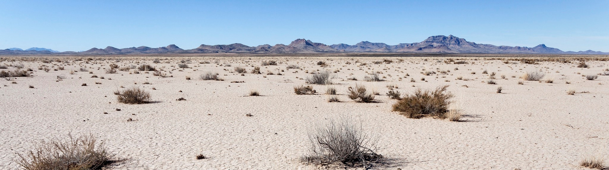
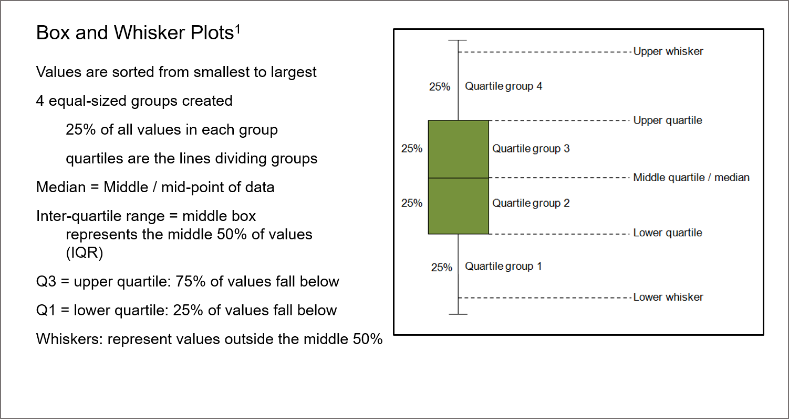

```{r setup, include=FALSE}
knitr::opts_chunk$set(echo = FALSE , message = FALSE , warning = FALSE)
```



# 1. Introduction {.tabset .tabset-fade .tabset-pills}
##
## About Ecological Sites

The U.S. Department of Agriculture Natural Resources Conservation Service (NRCS) defines ecological sites as "a distinctive kind of land with specific physical characteristics that differs from other kinds of land in its ability to produce a distinctive kind and amount of vegetation" ([USDA–NRCS, 2006](https://www.nrcs.usda.gov/wps/portal/nrcs/detail/national/landuse/rangepasture/?cid=stelprdb1068392)). Ecological sites determine not only the ecological potential of a site, but also how a site can respond to natural disturbance and management actions. Ecological sites have been delineated for many areas using physical and biotic features and are linked to soil map units. Soils, climate, hydrology, geology, physiographic features, plants species occurrences, plant community composition, annual biomass production, and plant-wildlife interactions all contribute to the proerties of ecological sites.  Ecological Site Descriptions (ESDs) describe the underlying factors associated with a specific ecological site, as well as different ecological states within a given site based on factors such as grazing, fire, drought, and other management actions. For an example of an ESD, see [EDIT Jornada](https://edit.jornada.nmsu.edu/page?content=class-description&catalog=3&spatial=84&class=5802#top-bookmark).

## Ecological Site Summary

Using ecological monitoring data, the overall status of an Ecological Site can be summarized into an Ecological Site Summary (ESS). At the site level, ecological site summaries generated from monitoring data can tell us about the condition and health of ecological sites based on indicators such as cover by structure and functional group, species dominance, species occurrences, canopy gap measurements, and soil stability measurements. These indicators can help inform the user of the ecological state of a given plot or overall site (i.e. shrubland state vs. grassland state). Identifying the ecological state allows us to not only determine the degree of departure from the corresponding reference ecological states, but also to inform management and restoration actions accordingly by determining the best pathway to a less degraded state. For more on state and transition models (STMs), see see [Bestelmeyer et al., 2017](https://link.springer.com/content/pdf/10.1007%2F978-3-319-46709-2_9.pdf).
A major data source for developing these summaries is the Assessment, Inventory, and Monitoring (AIM) Program along with the Landscape Monitoring Framework (LMF). AIM and LMF include almost 25,000 plots throughout the western United States (*see* [AIM Data Portal](https://aim.landscapetoolbox.org/data-management-project-evaluation/databases/)) stored in the Terrestrial AIM Database (TerrADat). Data garnered from AIM and LMF plots is both generalizable and scalable and thus applicable to management decisions across multiple disciplines at both local and national levels.

## ESS Tool

An Ecological Site Summary (ESS) tool has been developed to help users visualize the overall status of their region of interest within a specific ecological site, or across an ecological site group. This information can be summarized within a given administrative state or across political boundaries for landscape scale analysis. Ecological site summaries are generated using an R Markdown script with an interactive HTML output in which users can query summary tables, download full or filtered summary tables to view in Excel, explore interactive figures, and download static figures for their own use.

This report is an automated process and can be continually updated as new data becomes available each year or as lines of inquiry shift. This ESS information can be included in decision making processes for BLM managers, as it can help inform land use plans, grazing permit renewals, shrub or invasive species treatments, and/or seed menu development for ecological restoration and reclamation.

## Using the ESS Tool {.tabset .tabset-fade .tabset-pills}

This report generates many tables and figures that can be queried, filtered, and downloaded to meet your management and reporting needs. Multiple output types are used to meet multiple needs, so select the most relevant and useful output. You can also use this report in conjunction with the [AIM Data Portal](https://blm-egis.maps.arcgis.com/apps/webappviewer/index.html?id=ce9ca46b8cac4682b3dc7c156b6c42f8) to determine which plots fall within spatial queries.    

###
### I want this report generated for me

This report is generated in RMarkdown. If you have R limitations and would prefer the report to be generated for you, use this [template](https://github.com/R-Burke/EcologicalSiteSummaries/blob/master/ESS_Template.xlsx) to request that Jornada run the report.

### I want to group by other features for a custom report

In cases where ESDs are not developed, grouping AIM data by other features can provide similar information, and potentially lead to the development of new ESDs. For this purpose, it may be informative to group data by features such as watershed units, soil map units, or biophysical settings. Spatial groupings may also be beneficial if you want to compare data that's in the same ecological site but across multiple management units such as grazing allotments, pastures, prescribed burn areas, etc. Grouping indicators by other spatial attributes is available in a customized report on page two of this [template](https://github.com/R-Burke/EcologicalSiteSummaries/blob/master/ESS_Template.xlsx).

### I want to run this report myself {.tabset .tabset-fade .tabset-pills}

**BLM Users:** make sure you have R installed on your local drive and that packages are being installed on your local drive as well. You most likely will not be able to render this report on a network drive. *To get started, you will need to follow the step by step instructions in the R and SQL set up tutorial to generate this report. It's a lot of steps at the beginning, but will eventually allow you to generate rapid automated reporting (once set up, this report should take less than 5 minutes per ecological site)*.  

####
#### Getting started {.tabset .tabset-fade .tabset-pills}

#####
##### Access the script

Download the RMarkdown script and supporting files by downloading the full Ecological Site Summary repository in a zipped folder [here](https://github.com/R-Burke/EcologicalSiteSummaries-master). Unzip the folder into your local drive documents (i.e. C:/Users/JSmith/Documents/EcologicalSiteSummaries).  

##### Starting a project in R
Open the ESS_BLM.Rmd file that's in the repository you unzipped to your local drive. Open the file using RStudio. The supporting documents in this folder will be necessary to run the script. This is an RMarkdown script with an HTML output. 

Read this document alongside the RMarkdown script. If you don't know how to start a project in RMarkdown, see the tutorial in the repository folder.  

##### Install Packages

You will need to install several packages to run this report. Make sure every package is installed in your library folder within your R folder on your local drive (i.e. C:/Users/JSmith/Documents/R/win-library). You may have to do this manually on a BLM computer rather than a batch installation (Tools -> Install Packages). You will need to install the following: 
kableExtra, knitr, leaflet, magrittr, plotly, patternplot, raster, RColorBrewer, rgdal, RODBC, rworldmap, rworldxtra, units, and tidyverse. 

##### Set your ecological site

To generate these reports, you need to specify your ecological site(s) of interest. You can specify a single ecological site that is restricted by state lines or create a list of multiple ecological sites that can span political boundaries. 

*Type in the ecological site id between the " " in the code below (line 80).*

```{r file paths , echo = TRUE , include = TRUE}

#Define your ecological site

EcoSite <- c("R023XY308OR")

#If you want to summarize multiple ecological sites, list them between the ()
#i.e. to group Sandy and Shallow sandy sites- 
#EcoSite <- c("R042XB012NM" , "R042XB015NM")

```

##### Connect to the database

``` {r ESS Demo, echo = FALSE, include = FALSE}

#Load required packages

#The following Packages are required to connect to the AIM Pub Database
library(RODBC)
library(dplyr)

#The remaining packages are required to generate the ESS Report

library(tidyverse)
library(knitr)
library(kableExtra)
library(leaflet)
library(patternplot)
library(magrittr)
library(rgdal)
library(RColorBrewer)
library(units)
library(sp)
library(sf)
library(rworldmap)
library(rworldxtra)
library(raster)
library(plotly)

```

```{r pub connection , echo = FALSE , include = FALSE}

```

##### Run the report!

The rest of the report is automated and requires no edits. 
Click the Knit button and knit to an HTML. The output HTML document will be saved in the repository folder. View the document in Google Chrome or Firefox (*some features will be disabled in Internet Explorer*). You need to be connected to the internet to run the report, but you can view it without internet (*note that the basemap feature will be disabled offline*).

```{r get LMF and TDat happy , echo = FALSE , include = FALSE}
#Before getting LMF&TerrADat together, rename date field in LMF to play nice

LMF <- LMF %>% rename(DateEstablished = DateVisited) #this will be an issue if revists become a thing in LMF


#LMF Ecological Site Ids do not have R or F in front... so we need to fix some things

#Read in full csv of ecological site ids from EDIT

EDIT <- read.csv(file = "EDIT_public_ecological_site_list.csv")

#Add a new column with R or F dropped

EDIT[["EcoSiteId_Stripped"]] <- gsub(EDIT[["new_es_symbol"]],
                                     pattern = "^[RF]", replacement = "")

#Check to see if unique
ecosite_lut <- unique(EDIT[,c("new_es_symbol" , "EcoSiteId_Stripped")])

any(table(ecosite_lut[["EcoSiteId_Stripped"]]) > 1)

#Pull out the repeat ids (fortunatley there are only 15)

trouble_ids <- names(table(ecosite_lut[["EcoSiteId_Stripped"]]))[table(ecosite_lut[["EcoSiteId_Stripped"]]) > 1]

#Drop the repeat ids
ecosite_lut_drop_bad <- ecosite_lut %>% filter(!EcoSiteId_Stripped == trouble_ids)

#Add a new field called EcologicalSiteId that has the dropped R and F
EcoSites_Update <- ecosite_lut_drop_bad %>% mutate(EcologicalSiteId = EcoSiteId_Stripped)

#Merge the dataframe with the full EcologicalSiteId and dropped R/F Id with the LMF
LMF_EcoSite <- merge(LMF , EcoSites_Update, by = "EcologicalSiteId")

#Drop the EcologicalSiteId value that we added earlier
LMF_EcoSite <- LMF_EcoSite %>% dplyr::select(-EcologicalSiteId)

#Rename Ecological SIte Id to the full Ecological Site Id code (= new_es_symbol)
LMF_EcoSite <- LMF_EcoSite %>% dplyr::rename(EcologicalSiteId = new_es_symbol)

LMF_EcoSite <- LMF_EcoSite %>% dplyr::select(-EcoSiteId_Stripped)

#Bind LMF and TerrADat
#Place NAs in non-matching columns
TerrADat[setdiff(names(LMF_EcoSite) , names(TerrADat))] <- NA
LMF_EcoSite[setdiff(names(TerrADat), names(LMF_EcoSite))] <- NA

TDat_LMF <- rbind(TerrADat , LMF_EcoSite)

#Bind LMF and TerrADat Species Indicators
#First need names to match, TDat species got cut off (comment this out if did not first export to shapefile)
#place NAs in non-matching columns
LMF_Species[setdiff(names(TerrADat_Species) , names(LMF_Species))] <- NA
TerrADat_Species[setdiff(names(LMF_Species), names(TerrADat_Species))] <- NA
Species_indicator <- rbind(TerrADat_Species , LMF_Species)

##Caption to use in your tables and plots
Caption <- paste0("Cover Summaries for Ecological Site" , EcoSite)

#Subset your ecological site and state
#Pull out year for map

TDat_LMF$DateEstablished <- sub("^(\\d{4}).*$", "\\1", TDat_LMF$DateEstablished)

TDat_LMF_plots_Year <- TDat_LMF %>% 
                    filter(!Latitude_NAD83 <= 1) %>% arrange(EcologicalSiteId) #Sorting this for the map and remove 0,0 lat lon

TDat_LMF_plots_Year <- TDat_LMF_plots_Year %>% rename(Year = DateEstablished)


#Subset based on EcologicalSiteId
EcoSitePlots <- TDat_LMF[TDat_LMF[["EcologicalSiteId"]] %in% EcoSite, ]
EcoSitePlots <- EcoSitePlots %>% mutate(AH_SagebrushCover_Dead = AH_SagebrushCover - AH_SagebrushCover_Live)
#for non-species indicators
EcoSite_PKs <- EcoSitePlots$PrimaryKey
#Keeping only the plots from accumulated species that match our EcoSite
Species_plots_ecosite <- Species_indicator[(Species_indicator[["PrimaryKey"]] %in% EcoSite_PKs), ]
Species_plots_ecosite <- Species_plots_ecosite  #For getting sample size in species indicators
###That's all the subsetting necessary
```

# 2. Interpreting report figures {.tabset .tabset-fade .tabset-pills}

This report uses boxplots to summarize cover values into quartiles while keeping outliers visible. The figures in this report are interactive within the tool. Hovering over the dots on the plot will give you the Plot ID of the plot from which the measure was obtained, as well as the individual species from which the measurement was obtained if applicable. Hovering over the boxplot will give you quartile values. The interactive figures can be downloaded as static figures to incorporate into reports.
*The following image explains how to interpret a boxplot.*

##
## Boxplot




# 3. Where are the data coming from? {.tabset .tabset-fade .tabset-pills}
##
## Plot Map \

Below is a map of  plots surveyed to date.
Plots in our ecological site of interest are highlighted in red. \

```{r map , echo = FALSE , include = FALSE}
#Set colors based on ecological site id, date, etc. This is flexible

EDIT_rename <- EDIT %>% rename(EcologicalSiteId = new_es_symbol)

#Get with full esd names

EcoSitePlots_EDIT <- merge(EcoSitePlots , EDIT_rename , by = "EcologicalSiteId")

TDat_LMF_plots_Year_EDIT <- merge(TDat_LMF_plots_Year , EDIT_rename, by = "EcologicalSiteId")

#Set color palette
Pal_EcoSite <- colorFactor(palette = 'YlOrRd' , domain = TDat_LMF_plots_Year_EDIT$es_name)
Pal_Date <- colorFactor(palette = 'Greys' , domain = TDat_LMF_plots_Year_EDIT$Year)
Pal_EcoSiteID <- colorFactor(palette = "Red" , domain = EcoSite)
EcoSite_All <- TDat_LMF_plots_Year_EDIT$es_name
Year <- TDat_LMF_plots_Year_EDIT$Year
EcoSite_All <- as.character(EcoSite_All) #for if we want to add all ecosites to the legend
Map <- leaflet(height = 650 , width = 650)

Map <- addTiles(Map) %>% addCircleMarkers(lng = ~Longitude_NAD83 , lat = ~Latitude_NAD83 , radius = 3 ,
                                          popup = paste("Ecological Site: " , TDat_LMF_plots_Year_EDIT$es_name, 
                                                        "Ecolgical Site Id: " , TDat_LMF_plots_Year_EDIT$EcologicalSiteId, 
                                                         sep = "<br>") , 
                                          color = ~Pal_Date(Year) ,
                                          fillOpacity = .5 , group = Year ,
                                          data = TDat_LMF_plots_Year_EDIT) %>%
                                          addCircleMarkers(lng = ~Longitude_NAD83 , lat = ~Latitude_NAD83 ,
                                                           radius = 3 ,
                                                           fillOpacity = 0.5 ,
                                                           popup = paste("Ecological Site: " ,EcoSitePlots_EDIT$es_name , 
                                                                         "Ecological Site Id: " , EcoSitePlots_EDIT$EcologicalSiteId , 
                                                                          sep = "<br>") , 
                                                           color = "red" , group = EcoSite ,
                                                           data = EcoSitePlots_EDIT) %>%
                                          addLayersControl(overlayGroups = c(EcoSite , Year) ,
                                          options = layersControlOptions(collapsed = TRUE)) %>%
                                          addLegend(pal = Pal_Date , values = TDat_LMF_plots_Year_EDIT$Year , opacity = 1 , group = Year) %>%
                                          addLegend(pal = Pal_EcoSiteID , values = EcoSite , opacity = 1 , group = EcoSite)
                                         
```

```{r interactive map, echo = FALSE , include = TRUE}
Map
```


```{r plots per year , echo = FALSE , include = FALSE}
Plots <- c("Plots")
#Add more colors beyond 2021
Year_Palette <- c("2008" = "grey97" , "2009" = "grey87" , "2010" = "grey77" , "2011" = "grey70" , "2012" = "grey65" ,
                  "2013" = "grey60" , "2014" = "grey50" , "2015" = "grey45" , "2016" = "grey40" , "2017" = "grey35" ,
                  "2018" = "grey30" , "2019" = "grey25" , "2020" = "grey20" , "2021" = "grey15")

Plots_Simple <- TDat_LMF_plots_Year %>% dplyr::select(PrimaryKey , Year, EcologicalSiteId) %>%   
                mutate(PlotsPerYear = Plots) %>%
                arrange(Year)

Plots_Simple_EcoSite <- Plots_Simple[Plots_Simple[["EcologicalSiteId"]] %in% EcoSite, ]

PlotsPerYear_Total <- ggplot(Plots_Simple , aes(Plots, text = stat(count))) +
                geom_bar(stat = "count" , position = position_stack(reverse = TRUE) ,
                         aes(fill = Year) , width = .2 , ) +
                scale_fill_manual(values = Year_Palette) +
                ggtitle("Plots Per Year, Nationally") +
                coord_flip() + theme(axis.text.y = element_blank())

PlotsPerYear_EcoSite <- ggplot(Plots_Simple_EcoSite , aes(Plots, text = stat(count))) +
                geom_bar(stat = "count" , position = position_stack(reverse = TRUE) ,
                         aes(fill = Year) , width = .2 , ) +
                scale_fill_manual(values = Year_Palette) +
                ggtitle(paste("Plots Per Year In: " , EcoSite)) + 
                coord_flip() + theme(axis.text.y = element_blank())

```


## Plots Per Year, All Ecological Sites (Nationally)

```{r plots figure , echo = FALSE , include = TRUE , fig.height = 3 , fig.width = 8 , fig.cap = "Total Plots Per Year, AIM & LMF"}
PlotsPerYear_Total <- ggplotly(PlotsPerYear_Total , tooltip = "text")
PlotsPerYear_Total
```

## Plots Per Year, Your Ecological Site(s)

```{r plots figure 2 , echo = FALSE , include = TRUE , fig.height = 3 , fig.width = 8, fig.cap = "Plots Per Year in Ecological Site, AIM & LMF"}
PlotsPerYear_EcoSite <- ggplotly(PlotsPerYear_EcoSite , tooltip = "text")
PlotsPerYear_EcoSite

```

# 4. Species Cover Summaries {.tabset .tabset-fade .tabset-pills}

Percent cover summaries use data from Line-point intercept (LPI) method to determine average cover of individual species, as well as summaries by structure and functional group cover, noxious versus non-noxious cover,  woody vs. non-woody cover, and cover by sage grouse group. From the AIM data, we can make some simple figures showing cover values. These figures, along with the summary tables, can quickly be incorporated into any documents where this data is used (i.e. NEPA documents for grazing permit renewals, shrub treatments, etc).

```{r species cover , echo = FALSE , include = FALSE}

Species_plots_ecosite_minusState <- Species_plots_ecosite %>% dplyr::select(-SpeciesState) %>% mutate_if(is.numeric, round , digits = 2) %>% 
                                    subset(AH_SpeciesCover > 0.0000)


#get species list for full names, remove states and then remove duplicates 

SpeciesList <- SpeciesList %>% rename(Species = SpeciesCode)  
#save this for later  %>% dplyr::select(-SpeciesState) %>% distinct(SpeciesList)

#Getting rid of additional info in scientific name for consistency

cap <- function(string){
 string_lower <- tolower(string)
 output <- paste0(toupper(substr(string_lower, 1, 1)), substr(string_lower, 2, nchar(string_lower)))
 return(output)
}

strip_info <- function(string){
 return(trimws(gsub(string,
                    pattern = "\\(.+$",
                    replacement = "")))
}

SpeciesList[["ScientificName"]] <- sapply(sapply(SpeciesList[["ScientificName"]], cap), strip_info)

#Converting common name to all lower case for consistency

SpeciesList[["CommonName"]] <- tolower(SpeciesList[["CommonName"]])

#merge with species list so we can hover for scientific name

Merged_Species <- merge(Species_plots_ecosite , SpeciesList , by = c("Species" , "SpeciesState")) %>% 
                  rename(GrowthHabit = GrowthHabit.x , GrowthHabitSub = GrowthHabitSub.x , Duration = Duration.x , 
                                            Noxious = Noxious.x , 
                                            SG.Group = SG_Group.x) %>% 
                                            mutate_if(is.numeric, round , digits = 2) %>%
                                            select(Species , ScientificName , PrimaryKey , PlotID ,  
                                                   AH_SpeciesCover , AH_SpeciesCover_n , Hgt_Species_Avg , 
                                                   Hgt_Species_Avg_n , GrowthHabit, GrowthHabitSub , Duration , 
                                                   Noxious , CommonName , SG.Group , DBKey) 
 
Merged_Species_PercCover <- Merged_Species %>% subset(AH_SpeciesCover > 0.000000) %>% 
                                                mutate(Tally = 1) %>% #tally will allow us to get a sample size
                                                dplyr::select(-Hgt_Species_Avg , -Hgt_Species_Avg_n) 

#ignored NAs- make disclosure as this may overestimate cover
Merged_Species_PercCover_ByPlot <- Merged_Species_PercCover %>% dplyr::select(-Tally)
Merged_Species_Trace <- Merged_Species %>% filter(is.na(AH_SpeciesCover))

Merged_Species_Heights <- Merged_Species 

#Remove duplictaes when row 1 and 3 (Species and PrimaryKey) are duplicates

Species_cover_summary <- Merged_Species_PercCover %>%  
                         group_by(Species , GrowthHabit , GrowthHabitSub , Duration , Noxious , ScientificName , CommonName , SG.Group) %>% 
                         summarize(AveragePercentCover = mean(AH_SpeciesCover) ,
                         StandardDeviation = sd(AH_SpeciesCover),
                         MinCover = min(AH_SpeciesCover) ,
                         MaxCover = max(AH_SpeciesCover) , n = sum(Tally)) %>%
                         mutate_if(is.numeric, round , digits = 2) %>%
                         dplyr::select(Species , ScientificName , AveragePercentCover , StandardDeviation ,
                                MinCover , MaxCover , n , GrowthHabit , GrowthHabitSub , Duration , 
                                Noxious , CommonName , SG.Group)

##Setting color palette for plot
NoxNonPal_Fill <- c("grey75"  , "#D55E00")
NoxNonPal_Dot <- c("grey33" , "#993300")

#Interactive plot set up for ggplotly, by SFG (no labels because ggplotly jumbles them. the information from the labels is in hover)

SFG_Plots_Interactive <- lapply(X = split(Merged_Species_PercCover, Merged_Species_PercCover[["GrowthHabitSub"]] , drop = TRUE), 
                                FUN = function(Merged_Species_PercCover){
  current_plot <- ggplot(Merged_Species_PercCover , aes(x = GrowthHabitSub , y = AH_SpeciesCover, 
                                              text = paste("Primary Key: " , PrimaryKey , 
                                                          "Plot ID: " , PlotID , "Species: " , 
                                                           ScientificName , "Code: " , Species , 
                                                           "Percent Cover: " , AH_SpeciesCover , "Noxious: " , Noxious , sep = "<br>"))) +
                                                                  geom_boxplot(width = .6 , outlier.shape = NA) +
                                                                  geom_jitter(width = .2 , size = 1.25 , shape = 21) +
                                                                  theme_light() +
                                                                  labs(y = "Percent Cover") +
                                                                  scale_y_continuous(limits = c(0 , 100))  +
                                                                  theme(axis.text.y = element_blank() , axis.ticks.y = element_blank() ,
                                                                        axis.title.y = element_blank() , axis.title.x = element_blank() ,  
                                                                        axis.line.y = element_blank()) + theme(panel.grid.major.y = element_blank() ,
                                                                                                        axis.title.y = element_blank()) +
                                                                  ggtitle(paste("Percent Cover by Functional Group: " , 
                                                                                Merged_Species_PercCover$GrowthHabitSub,
                                                                                EcoSite)) +
                                                                  coord_flip() + facet_grid(cols = vars(GrowthHabitSub) ,
                                                                                            rows = vars(Duration) , switch = "y" ,
                                                                                            scales = "free" , drop = TRUE)
return(current_plot)
})

#Static plot set up (includes labels)- this is typically what should be downloaded and included in reporting
SFG_Plots_Static <- lapply(X = split(Merged_Species_PercCover, Merged_Species_PercCover[["GrowthHabitSub"]] , drop = TRUE), 
                           FUN = function(Species_plots_ecosite){
  current_plot <- ggplot(Merged_Species_PercCover , aes(x = GrowthHabitSub , y = AH_SpeciesCover)) +
                                                                  geom_boxplot(width = .6 , outlier.shape = NA) +
                                                                  geom_jitter(width = .2 , size = 1.25, aes(color = Noxious)) +
                                                                  scale_color_manual(values = NoxNonPal_Dot) +
                                                                  theme_light() +
                                                                  labs(y = "Percent Cover") +
                                                                  scale_y_continuous(limits = c(0 , 100))  +
                                                                  theme(axis.text.y = element_blank() , axis.ticks.y = element_blank() ,
                                                                  axis.line.y = element_blank()) + theme(panel.grid.major.y = element_blank() ,
                                                                                                         axis.title.y = element_blank()) +
                                                                  ggtitle(paste("Percent Cover by Functional Group: " , 
                                                                                Merged_Species_PercCover$GrowthHabitSub , 
                                                                                EcoSite)) +
                                                                  coord_flip() + facet_grid(cols = vars(GrowthHabitSub) ,
                                                                                            rows = vars(Duration) , switch = "y" ,
                                                                                            scales = "free" , drop = TRUE)
return(current_plot)
})

#Split by growth habit and duration, then use species as X . excluding labels as above (until we figure out how to get ggplotly to play nice with labels)

Species_Plots_Interactive <- lapply(X = split(Merged_Species_PercCover, list(Merged_Species_PercCover$GrowthHabitSub , 
                                                                             Merged_Species_PercCover$Duration) , drop = TRUE),
                                  FUN = function(Merged_Species_PercCover){
   current_plot <- ggplot(Merged_Species_PercCover , aes(x = Species , y = AH_SpeciesCover, 
                                                         text = paste("PrimaryKey: ", PrimaryKey , 
                                                           "Plot ID: " , PlotID , "Species: " , 
                                                           ScientificName , "Code: " , Species , 
                                                           "Percent Cover: " , AH_SpeciesCover , "Noxious: " , Noxious , sep = "<br>"))) +
                                                           geom_boxplot(width = .6 , outlier.shape = NA) +
                                                           geom_jitter(width = .15 , size = 1, shape = 21) +
                                                           scale_y_continuous(limits = c(0 , 100)) +
                                                           theme_light() +
                                                           labs(y = "Percent Cover") + 
                                                           ggtitle(paste("Percent Cover by Species, " , 
                                                                         Merged_Species_PercCover$GrowthHabitSub, 
                                                                         Merged_Species_PercCover$Duration ,
                                                                         EcoSite)) + 
                                                           theme(axis.title.y = element_blank() , axis.title.x = element_blank())+   
                                                                 theme(panel.grid.major.y = element_blank() ,
                                                                 axis.title.y = element_blank()) +
                                                           coord_flip() +  facet_grid(cols = vars(GrowthHabitSub) , rows = vars(Duration) ,
                                                           switch = "y" ,  scales = "free" , drop = TRUE) 
return(current_plot)
})

#Static plots for plotting by species, including labels

Species_Plots_Static <- lapply(X = split(Merged_Species_PercCover, list(Merged_Species_PercCover$GrowthHabitSub , 
                                                                        Merged_Species_PercCover$Duration) , 
                                         drop = TRUE),
                                  FUN = function(Merged_Species_PercCover){
     current_plot <- ggplot(Merged_Species_PercCover , aes(x = Species , y = AH_SpeciesCover)) +
                            geom_boxplot(width = .6 , outlier.shape = NA) +
                            geom_jitter(width = .15 , size = 1 , aes(color = Noxious)) +
                            scale_color_manual(values = NoxNonPal_Dot) + scale_y_continuous(limits = c(0 , 100)) +
                            theme_light() +
                            labs(y = "Percent Cover") + 
                            ggtitle(paste("Percent Cover by Species, " , 
                                          Merged_Species_PercCover$GrowthHabitSub , 
                                          Merged_Species_PercCover$Duration , 
                                          EcoSite)) + 
                            theme(axis.title.y = element_blank()) +
                            coord_flip() +  facet_grid(cols = vars(GrowthHabitSub) , rows = vars(Duration) ,
                            switch = "y" , scales = "free" , drop = TRUE) 
return(current_plot)
})


#Sage Grouse Species Plots, Preferred Forbs

Merged_Species_SG <- Merged_Species_PercCover %>% filter(!is.na(SG.Group))

Merged_Species_SG_PrefForb <- Merged_Species_SG %>% mutate(PreferredForb = (SG.Group == "PreferredForb")) %>% 
                              subset(PreferredForb == TRUE) %>% 
                              subset(AH_SpeciesCover > 0.0000)


PrefForb_Plots_Interactive <-  if (nrow(Merged_Species_SG_PrefForb) < 1) {PrefForb_Plots_Interactive <- NULL} else{
                               ggplot(Merged_Species_SG_PrefForb , aes(x = Species , y = AH_SpeciesCover, 
                                                                       text = paste("Primary Key: " , PrimaryKey , 
                                                                                    "Plot ID: " , PlotID , 
                                                                                    "Species: " , ScientificName , 
                                                                                    "Code: " , Species , 
                                                                                    "Sage Grouse Group: " , SG.Group , 
                                                                                    "Duration: " , Duration ,
                                                                                    "Percent Cover: " , AH_SpeciesCover , 
                                                                                    "Noxious: " , Noxious , sep = "<br>"))) +
                                                           geom_boxplot(width = .6 , outlier.shape = NA) +
                                                           geom_jitter(width = .15 , size = 1 , shape = 21) +
                                                           scale_y_continuous(limits = c(0 , 100)) +
                                                           theme_light() +
                                                           labs(y = "Percent Cover") + 
                                                           ggtitle(paste("Percent Cover, Preferred Forbs: " , EcoSite)) + 
                                                           theme(axis.title.y = element_blank() , axis.title.x = element_blank()) +
                                                                 theme(panel.grid.major.y = element_blank() ,
                                                                 axis.title.y = element_blank()) +
                                                           coord_flip() 
}

#add this if statement to every plot. it will return NULL if the dataframe is empty

PrefForb_Static <- if (nrow(Merged_Species_SG_PrefForb) < 1) {PrefForb_Static <- NULL} else{
                      ggplot(Merged_Species_SG_PrefForb , aes(x = Species , y = AH_SpeciesCover)) +
                                                           geom_boxplot(width = .6 , outlier.shape = NA) +
                                                           geom_jitter(width = .15 , size = 1) +
                                                           scale_y_continuous(limits = c(0 , 100)) +
                                                           theme_light() +
                                                           labs(y = "Percent Cover") + 
                                                           ggtitle(paste("Percent Cover, Preferred Forbs: " , EcoSite)) + 
                                                           theme(panel.grid.major.y = element_blank()) +
                                                           coord_flip() 
}
##SG GROUP

SGGroup_Plots_Interactive <- ggplot(Merged_Species_SG , aes(x = SG.Group , y = AH_SpeciesCover, 
                                                           text = paste("Primary Key: " , PrimaryKey , 
                                                           "Plot ID: " , PlotID , "Species: " , 
                                                           ScientificName , "Code: " , Species , 
                                                           "Sage Grouse Group: " , SG.Group , 
                                                           "Percent Cover: " , AH_SpeciesCover , "Noxious: " , Noxious , sep = "<br>"))) +
                                                           geom_boxplot(width = .6 , outlier.shape = NA) +
                                                           geom_jitter(width = .15 , size = 1 , shape = 21) +
                                                           scale_y_continuous(limits = c(0 , 100)) +
                                                           theme_light() +
                                                           ggtitle(paste("Percent Cover, Sage Grouse Group: " , EcoSite)) + 
                                                           theme(axis.title.y = element_blank() , axis.title.x = element_blank()) +
                                                                 theme(panel.grid.major.y = element_blank() ,
                                                                 axis.title.y = element_blank()) + 
                                                           coord_flip() 

SGGroup_Static <- ggplot(Merged_Species_SG , aes(x = SG.Group , y = AH_SpeciesCover)) +
                                                           geom_boxplot(width = .6 , outlier.shape = NA) +
                                                           geom_jitter(width = .15 , size = 1) +
                                                           scale_y_continuous(limits = c(0 , 100)) +
                                                           theme_light() +
                                                           labs(y = "Percent Cover") + 
                                                           ggtitle(paste("Percent Cover, Preferred Forbs: " , EcoSite)) + 
                                                           theme(panel.grid.major.y = element_blank()) + 
                                                                  facet_grid(rows = vars(SG.Group) , 
                                                                             switch = "y" ,
                                                                             scales = "free" ,
                                                                             drop = TRUE) +
                                                           coord_flip() 

#Plotting sagebrush

SageBrushCover <- EcoSitePlots %>% dplyr::select(PlotID , PrimaryKey , AH_SagebrushCover , AH_SagebrushCover_Live , AH_SagebrushCover_Dead) %>%
                  mutate_if(is.numeric, round , digits = 2)

SageBrushCover_Tall <- gather(SageBrushCover , key = SageBrushCover , value = Percent , AH_SagebrushCover:AH_SagebrushCover_Dead)

SageBrush_Plots_Interactive <-  if (nrow(SageBrushCover_Tall) < 1) {SageBrush_Plots_Interactive <- NULL} else{
                               ggplot(SageBrushCover_Tall , aes(x = SageBrushCover , y = Percent , 
                                                                text = paste("Primary Key: " , PrimaryKey , 
                                                                             "Plot ID: " , PlotID ,
                                                                             "Percent Cover: " , Percent , 
                                                                             sep = "<br>"))) +
                                                           geom_boxplot(width = .6 , outlier.shape = NA) +
                                                           geom_jitter(width = .15 , size = 1 , shape = 21) +
                                                           scale_y_continuous(limits = c(0 , 100)) +
                                                           theme_light() +
                                                           labs(y = "Percent Cover") + 
                                                           ggtitle(paste("Percent Cover, Sagebrush: " , EcoSite)) + 
                                                           theme(axis.title.y = element_blank() , axis.title.x = element_blank()) +
                                                                 theme(panel.grid.major.y = element_blank() ,
                                                                 axis.title.y = element_blank() , 
                                                                 axis.title.x = element_blank()) +
                                                                 coord_flip()}

SageBrush_Plots_Static <-  if (nrow(SageBrushCover_Tall) < 1) {SageBrush_Plots_Static <- NULL} else{
                               ggplot(SageBrushCover_Tall , aes(x = SageBrushCover , y = Percent)) +
                                                           geom_boxplot(width = .6 , outlier.shape = NA) +
                                                           geom_jitter(width = .15 , size = 1) +
                                                           scale_y_continuous(limits = c(0 , 100)) +
                                                           theme_light() +
                                                           labs(y = "Percent Cover") + 
                                                           ggtitle(paste("Percent Cover, Sagebrush: " , EcoSite)) + 
                                                           theme(panel.grid.major.y = element_blank()) + 
                                                           coord_flip()}


#Noxious vs NonNoxious Cover Plot
Nox_Non <- (Merged_Species) %>% group_by(Noxious) %>% filter(!is.na(Noxious)) %>% filter(!is.na(AH_SpeciesCover))
Nox_Non$Noxious <- gsub("YES" , "Yes", Nox_Non$Noxious)
Nox_Non$Noxious <- gsub("NO", "No", Nox_Non$Noxious)

Nox_Non_Plot_Interactive <- ggplot(data = Nox_Non , (aes(x = Noxious , y = AH_SpeciesCover , 
                                                           text = paste("Primary Key : " , PrimaryKey , 
                                                           "Plot ID: " , PlotID , "Species: " , 
                                                           ScientificName , "Code: " , Species , 
                                                           "Percent Cover: " , AH_SpeciesCover , 
                                                           "Noxious: " , Noxious , sep = "<br>")))) +
                                                 geom_boxplot(width = .6 , outlier.shape = NA) +
                                                 geom_jitter(width = .15 , size = 1.25 , shape = 21) +
                                                 theme_light() +
                                                 scale_y_continuous(limits = c(0 , 100)) +
                                                 labs(y = "Percent Cover") + 
                                                 ggtitle(paste("Percent Cover, Noxious vs. Non-Noxious Species: " , EcoSite)) +
                                                 theme(axis.title.y = element_blank() , axis.text.y = element_blank() , axis.ticks.y = element_blank() ,
                                                                  axis.line.y = element_blank() , axis.title.x = element_blank()) +
                                                 theme(panel.grid.major.y = element_blank() , legend.position = "none") +
                                                                  coord_flip() + facet_grid(rows = vars(Noxious) ,
                                                                  switch = "y" , scales = "free" , drop = TRUE) 

Nox_Non_Plot_Static <- ggplot(data = Nox_Non , (aes(x = Noxious , y = AH_SpeciesCover))) +
                                                 geom_boxplot(width = .6 , outlier.shape = NA) +
                                                 geom_jitter(width = .15 , size = 1.25 , aes(color = Noxious)) +
                                                 scale_color_manual(values = NoxNonPal_Dot) +
                                                 theme_light() +
                                                 scale_y_continuous(limits = c(0 , 100)) +
                                                 labs(y = "Percent Cover") + 
                                                 ggtitle(paste("Percent Cover, Noxious vs. Non-Noxious Species: " , EcoSite)) +
                                                 theme(axis.title.y = element_blank() , axis.text.y = element_blank() , axis.ticks.y = element_blank() ,
                                                                  axis.line.y = element_blank() , 
                                                                  panel.grid.major.y = element_blank() , legend.position = "none") +
                                                                  coord_flip() + facet_grid(rows = vars(Noxious) ,
                                                                  switch = "y" , scales = "free" , drop = TRUE)
                                               
                                               
```

##

## Figures {.tabset .tabset-fade .tabset-pills}

###

### Cover by Functional Group {.tabset .tabset-fade .tabset-pills}

####

#### Graminoid {.tabset .tabset-fade .tabset-pills}
#####
##### Interactive 
```{r SFG plots grass , fig.height = 5 , fig.width = 10 , echo = FALSE, include = TRUE}
Graminoid_SFG_Ly <- ggplotly(SFG_Plots_Interactive[["Graminoid"]] , tooltip = "text")
Graminoid_SFG_Ly

```

##### Static 
```{r SFG plots grass static, fig.height = 5 , fig.width = 10 , echo = FALSE, include = TRUE}

SFG_Plots_Static[["Graminoid"]]

```


#### Forb {.tabset .tabset-fade .tabset-pills}
#####
##### Interactive

```{r SFG plots forb , fig.height = 5 , fig.width = 10 , echo = FALSE, include = TRUE}
Forb_SFG_Ly <- ggplotly(SFG_Plots_Interactive[["Forb"]] , tooltip = "text")
Forb_SFG_Ly
```

##### Static 

```{r SFG plots forb static, fig.height = 5 , fig.width = 10 , echo = FALSE, include = TRUE}

SFG_Plots_Static[["Forb"]] 

```

#### Sub Shrub {.tabset .tabset-fade .tabset-pills}
#####
##### Interactive 

```{r SFG plots subshrub , fig.height = 5 , fig.width = 10 , echo = FALSE, include = TRUE}
SubShrub_SFG_Ly <- ggplotly(SFG_Plots_Interactive[["SubShrub"]] , tooltip = "text")
SubShrub_SFG_Ly
```

##### Static 

```{r SFG plots subshrub static, fig.height = 5 , fig.width = 10 , echo = FALSE, include = TRUE}
SFG_Plots_Static[["SubShrub"]]

```

####  Shrub {.tabset .tabset-fade .tabset-pills}
#####
##### Interactive 

```{r SFG plots shrub , fig.height = 5 , fig.width = 10 , echo = FALSE, include = TRUE}
Shrub_SFG_Ly <- ggplotly(SFG_Plots_Interactive[["Shrub"]] , tooltip = "text")
Shrub_SFG_Ly
```

##### Static 

```{r SFG plots shrub static, fig.height = 5 , fig.width = 10 , echo = FALSE, include = TRUE}
SFG_Plots_Static[["Shrub"]]

```

####  Tree {.tabset .tabset-fade .tabset-pills}
#####
##### Interactive 

```{r SFG plots tree , fig.height = 5 , fig.width = 10 , echo = FALSE, include = TRUE}
Tree_SFG_Ly <- ggplotly(SFG_Plots_Interactive[["Tree.Perennial"]] , tooltip = "text")
Tree_SFG_Ly
```

##### Static 

```{r SFG plots tree static , fig.height = 5 , fig.width = 10 , echo = FALSE, include = TRUE}
Tree_SFG <- SFG_Plots_Static[["Tree.Perennial"]]
Tree_SFG
```

####  Succulent {.tabset .tabset-fade .tabset-pills}
#####
##### Interactive 

```{r SFG plots succulent , fig.height = 5 , fig.width = 10 , echo = FALSE, include = TRUE}
Succulent_SFG_Ly <- ggplotly(SFG_Plots_Interactive[["Succulent.Perennial"]] , tooltip = "text")
Succulent_SFG_Ly
```

##### Static

```{r SFG plots succulent static , fig.height = 5 , fig.width = 10 , echo = FALSE, include = TRUE}
SFG_Plots_Static[["Succulent.Perennial"]]

```

### Cover by Noxious, Non-Noxious Species {.tabset .tabset-fade .tabset-pills}
####
#### Interactive 

```{r nox plots , fig.height = 4 , fig.width = 10 , echo = FALSE, include = TRUE}
Nox_Non_Plot_Ly <- ggplotly(Nox_Non_Plot_Interactive , tooltip = "text")
Nox_Non_Plot_Ly
```

#### Static

```{r nox plots static , fig.height = 4 , fig.width = 10 , echo = FALSE, include = TRUE}

Nox_Non_Plot_Static

```

### Cover by Species {.tabset .tabset-fade .tabset-pills}

####

#### Graminoid , Annual {.tabset .tabset-fade .tabset-pills}
#####

##### Interactive 

<div class = "ScrollStyle">


```{r species plots grass annual , fig.height = 10  , fig.width = 10 , echo = FALSE, include = TRUE , results = 'asis'}
Graminoid_Species_Ly <- ggplotly(Species_Plots_Interactive[["Graminoid.Annual"]] , tooltip = "text")
Graminoid_Species_Ly
```

</div>

##### Static 

<div class = "ScrollStyle">


```{r species plots grass annual static , fig.height = 10 , fig.width = 10 , echo = FALSE, include = TRUE , results = 'asis'}

Species_Plots_Static[["Graminoid.Annual"]]

```

</div>


#### Graminoid , Perennial {.tabset .tabset-fade .tabset-pills}
#####
##### Interactive

<div class = "ScrollStyle">

```{r species plots grass perennial, fig.height = 10 , fig.width = 10 , echo = FALSE, include = TRUE , results = 'asis'}
Graminoid_Species_Ly <- ggplotly(Species_Plots_Interactive[["Graminoid.Perennial"]] , tooltip = "text")
Graminoid_Species_Ly
```

</div>

##### Static


```{r species plots grass perennial static, fig.height = 10 , fig.width = 10 , echo = FALSE, include = TRUE , results = 'asis'}

Species_Plots_Static[["Graminoid.Perennial"]]
```


#### Forb, Annual {.tabset .tabset-fade .tabset-pills}
#####
##### Interactive

<div class = "ScrollStyle">


```{r species plots forb annual , fig.height = 10 , fig.width = 10 , echo = FALSE, include = TRUE , results = 'asis'}
Forb_Species_Ly <- ggplotly(Species_Plots_Interactive[["Forb.Annual"]] , tooltip = "text")
Forb_Species_Ly
```

</div>

##### Static 


```{r species plots forb annual static , fig.height = 10 , fig.width = 10 , echo = FALSE, include = TRUE , results = 'asis'}

Species_Plots_Static[["Forb.Annual"]]
```


#### Forb, Perennial {.tabset .tabset-fade .tabset-pills}
#####
##### Interactive 

<div class = "ScrollStyle">

```{r species plots forb perennial , fig.height = 10 , fig.width = 10 , echo = FALSE, include = TRUE , results = 'asis'}
Forb_Species_Ly <- ggplotly(Species_Plots_Interactive[["Forb.Perennial"]] , tooltip = "text")
Forb_Species_Ly
```

</div>

##### Static 


```{r species plots forb perennial static, fig.height = 10 , fig.width = 10 , echo = FALSE, include = TRUE , results = 'asis'}

Species_Plots_Static[["Forb.Perennial"]]

```


#### Sub Shrub {.tabset .tabset-fade .tabset-pills}
#####
##### Interactive 

<div class = "ScrollStyle">


```{r species plots subshrub , fig.height = 10 , fig.width = 10 , echo = FALSE, include = TRUE , results = 'asis'}
SubShrub_Species_Ly <- ggplotly(Species_Plots_Interactive[["SubShrub"]] , tooltip = "text")
SubShrub_Species_Ly
```

</div>

##### Static 

<div class = "ScrollStyle">


```{r species plots subshrub static, fig.height = 10 , fig.width = 10 , echo = FALSE, include = TRUE , results = 'asis'}

Species_Plots_Static[["SubShrub"]]

```

</div>

#### Shrub {.tabset .tabset-fade .tabset-pills}
#####
##### Interactive 
<div class = "ScrollStyle">

```{r species plots shrub , fig.height = 10 , fig.width = 10 , echo = FALSE, include = TRUE , results = 'asis'}
Shrub_Species_Ly <- ggplotly(Species_Plots_Interactive[["Shrub"]] , tooltip = "text")
Shrub_Species_Ly
```

</div>


##### Static 
<div class = "ScrollStyle">

```{r species plots shrub static , fig.height = 10 , fig.width = 10 , echo = FALSE, include = TRUE , results = 'asis'}

Species_Plots_Static[["Shrub"]]

```

</div>

#### Tree {.tabset .tabset-fade .tabset-pills}
#####
##### Interactive 

<div class = "ScrollStyle">

```{r species plots tree , fig.height = 10 , fig.width = 10 , echo = FALSE, include = TRUE , results = 'asis'}
Tree_Species_Ly <- ggplotly(Species_Plots_Interactive[["Tree"]] , tooltip = "text")
Tree_Species_Ly
```

</div>

##### Static 

<div class = "ScrollStyle">

```{r species plots tree static, fig.height = 10 , fig.width = 10 , echo = FALSE, include = TRUE , results = 'asis'}

Species_Plots_Static[["Tree"]]

```

</div>

#### Succulent {.tabset .tabset-fade .tabset-pills}
#####
##### Interactive 

<div class = "ScrollStyle">
```{r species plots succulent , fig.height = 10 , fig.width = 10 , echo = FALSE, include = TRUE , results = 'asis'}
Succulent_Species_Ly <- ggplotly(Species_Plots_Interactive[["Succulent"]] , tooltip = "text")
Succulent_Species_Ly
```

</div>

##### Static 

<div class = "ScrollStyle">
```{r species plots succulent static , fig.height = 10 , fig.width = 10 , echo = FALSE, include = TRUE , results = 'asis'}

Species_Plots_Static[["Succulent"]]

```
</div>


### Sage Grouse Indicators {.tabset .tabset-fade .tabset-pills}

#### By Sage Grouse Group  {.tabset .tabset-fade .tabset-pills}

#####
##### Interactive

<div class = "ScrollStyle">

```{r sggroup interactive , fig.height = 10 , fig.width = 10 , echo = FALSE, include = TRUE , results = 'asis'}

SGGroup_Ly <- ggplotly(SGGroup_Plots_Interactive , tooltip = "text")
SGGroup_Ly

```
</div>

##### Static

<div class = "ScrollStyle">

```{r sggroup static , fig.height = 10 , fig.width = 10 , echo = FALSE, include = TRUE , results = 'asis'}

SGGroup_Static

```

</div>


#### Preferred Forbs  {.tabset .tabset-fade .tabset-pills}

#####
##### Interactive

<div class = "ScrollStyle">

```{r pref forb interactive , fig.height = 10 , fig.width = 10 , echo = FALSE, include = TRUE , results = 'asis'}

PrefForb_Ly <- ggplotly(PrefForb_Plots_Interactive , tooltip = "text")
PrefForb_Ly
```
</div>

##### Static

<div class = "ScrollStyle">
```{r pref forb static, fig.height = 10 , fig.width = 10 , echo = FALSE, include = TRUE , results = 'asis'}

PrefForb_Static

```

</div>

#### Sagebrush  {.tabset .tabset-fade .tabset-pills}

#####
##### Interactive

<div class = "ScrollStyle">

```{r sagebrush interactive , fig.height = 10 , fig.width = 10 , echo = FALSE, include = TRUE , results = 'asis'}

SageBrush_Ly <- ggplotly(SageBrush_Plots_Interactive , tooltip = "text")
SageBrush_Ly

```
</div>

##### Static

<div class = "ScrollStyle">

```{r pref sagebrush static, fig.height = 10 , fig.width = 10 , echo = FALSE, include = TRUE , results = 'asis'}

SageBrush_Plots_Static

```
</div>

```{r tables , echo = FALSE, include = TRUE}

#noxious vs non

NoxNNox <- Merged_Species_PercCover %>% group_by(Noxious , Tally) %>% filter(!is.na(AH_SpeciesCover)) %>%
           summarize(AveragePercentCover = mean(AH_SpeciesCover) ,
                         StandardDeviation = sd(AH_SpeciesCover),
                         MinCover = min(AH_SpeciesCover) ,
                         MaxCover = max(AH_SpeciesCover) , n = sum(Tally)) %>%
                         mutate_if(is.numeric, round , digits = 2) %>% dplyr::select(-Tally)

NoxNNox_ByPlot <- Merged_Species_PercCover %>% group_by(Noxious , PrimaryKey , PlotID , Tally) %>% 
                        filter(!is.na(AH_SpeciesCover)) %>%
                         summarize(AveragePercentCover = mean(AH_SpeciesCover) ,
                         StandardDeviation = sd(AH_SpeciesCover),
                         MinCover = min(AH_SpeciesCover) ,
                         MaxCover = max(AH_SpeciesCover) , n = sum(Tally)) %>%
                         mutate_if(is.numeric, round , digits = 2) %>% dplyr::select(-Tally)

#SFG
Summary_SFG_State <- Merged_Species_PercCover %>% filter(!is.na(AH_SpeciesCover)) %>%
                         group_by(GrowthHabitSub, Duration, Tally) %>%
                         summarize(AveragePercentCover = mean(AH_SpeciesCover) ,
                         StandardDeviation = sd(AH_SpeciesCover),
                         MinCover = min(AH_SpeciesCover) ,
                         MaxCover = max(AH_SpeciesCover) , n = sum(Tally)) %>%
                         mutate_if(is.numeric, round , digits = 2) %>% dplyr::select(-Tally)
# n = # of plants within each group for the calculation
#subsetting Average > 0 removes species codes that did not occur on that ecological site

#Summary SFG Per Plot

Summary_SFG_State_ByPlot <- Merged_Species_PercCover %>% 
                            group_by(PrimaryKey , PlotID , GrowthHabitSub , Duration , Tally) %>%
                            summarize(AveragePercentCover = mean(AH_SpeciesCover) ,
                            StandardDeviation = sd(AH_SpeciesCover),
                            MinCover = min(AH_SpeciesCover) ,
                            MaxCover = max(AH_SpeciesCover) , n = sum(Tally)) %>%
                            mutate_if(is.numeric, round , digits = 2) %>% dplyr::select(-Tally)

#species with cover values = 0 may still be present on species list from spp. inventory

Summary_SG_Group <- Merged_Species_SG %>% filter(!is.na(AH_SpeciesCover)) %>%
                         group_by(SG.Group, Tally) %>%
                         summarize(AveragePercentCover = mean(AH_SpeciesCover) ,
                         StandardDeviation = sd(AH_SpeciesCover),
                         MinCover = min(AH_SpeciesCover) ,
                         MaxCover = max(AH_SpeciesCover) , n = sum(Tally)) %>%
                         mutate_if(is.numeric, round , digits = 2) %>% dplyr::select(-Tally)
# Sage grouse group by plot

Summary_SG_Group_ByPlot <- Merged_Species_SG %>% filter(!is.na(AH_SpeciesCover)) %>%
                         group_by(SG.Group, PrimaryKey , PlotID , Tally) %>%
                         summarize(AveragePercentCover = mean(AH_SpeciesCover) ,
                         StandardDeviation = sd(AH_SpeciesCover),
                         MinCover = min(AH_SpeciesCover) ,
                         MaxCover = max(AH_SpeciesCover) , n = sum(Tally)) %>%
                         mutate_if(is.numeric, round , digits = 2) %>% dplyr::select(-Tally)

Summary_PrefForb <- Merged_Species_SG_PrefForb %>% filter(!is.na(AH_SpeciesCover)) %>%
                         group_by(Species, Tally) %>%
                         summarize(AveragePercentCover = mean(AH_SpeciesCover) ,
                         StandardDeviation = sd(AH_SpeciesCover),
                         MinCover = min(AH_SpeciesCover) ,
                         MaxCover = max(AH_SpeciesCover) , n = sum(Tally)) %>%
                         mutate_if(is.numeric, round , digits = 2) %>% dplyr::select(-Tally)


# By Plot

Summary_PrefForb_ByPlot <- Merged_Species_SG_PrefForb %>% filter(!is.na(AH_SpeciesCover)) %>%
                         group_by(Species, PrimaryKey , PlotID) %>%
                         mutate_if(is.numeric, round , digits = 2) 
                         
Summary_Woody_State <- Merged_Species_PercCover %>% filter(!is.na(AH_SpeciesCover)) %>%
                         group_by(GrowthHabit , Tally) %>%
                         summarize(AveragePercentCover = mean(AH_SpeciesCover) ,
                         StandardDeviation = sd(AH_SpeciesCover),
                         MinCover = min(AH_SpeciesCover) ,
                         MaxCover = max(AH_SpeciesCover) , n = sum(Tally)) %>%
                         subset(AveragePercentCover > 0.0000) %>%
                         mutate_if(is.numeric, round , digits = 2) %>% dplyr::select(-Tally)

#Woody versis non, by plot
Summary_Woody_State_ByPlot <- Merged_Species_PercCover %>% filter(!is.na(AH_SpeciesCover)) %>%
                         group_by(GrowthHabit , PrimaryKey , PlotID , Tally) %>%
                         summarize(AveragePercentCover = mean(AH_SpeciesCover) ,
                         StandardDeviation = sd(AH_SpeciesCover),
                         MinCover = min(AH_SpeciesCover) ,
                         MaxCover = max(AH_SpeciesCover) , n = sum(Tally)) %>%
                         mutate_if(is.numeric, round , digits = 2) %>% dplyr::select(-Tally)

                         #subsetting Average > 0 removes species codes that did not occur on that ecological site
                         #species with cover values = 0 may still be present on species list from spp. inventory
```

## Summary Tables {.tabset .tabset-fade .tabset-pills}

Foliar cover values are summarized in tables below. Tables summarize data across the ecological site as well as by plot within the ecological site. *Note that percent cover on a per-plot basis is not cumulative because we are calculating cover from any hit on line point intercept. Percent cover values per plot could therefore potentially add up to over 100. See Ground Cover Summary Table for total foliar cover estimates.* Per plot measurements are intended to allow you to compare plot level data to the status of the ecological site as a whole. 

###

### Percent Cover by Species {.tabset .tabset-fade .tabset-pills}
####
#### By Plot

Percent cover by species by plot within your specified ecological site. 

```{r plots, echo = FALSE , resutls = 'asis' , fig.height = 8}
Merged_Species_PercCover_ByPlot %>%  DT::datatable(extensions = 'Buttons', filter = "top" , options = list(scrollX = TRUE ,
                          dom = 'Bfrtip',
                          buttons =
                          list(list(
                          extend = 'collection',
                          buttons = c('csv', 'excel'),
                          text = 'Download Table'))) , 
                          caption = (paste("Percent Cover by Species by Plot within " , EcoSite)) , 
                          rownames = FALSE)
```

#### Ecological Site 

Percent cover by species averaged across the ecological site.

```{r species, echo = FALSE , resutls = 'asis' , fig.height = 8}

Species_cover_summary %>%  DT::datatable(extensions = 'Buttons', filter = "top" , options = list(scrollX = TRUE ,
                          dom = 'Bfrtip',
                          buttons =
                          list(list(
                          extend = 'collection',
                          buttons = c('csv', 'excel'),
                          text = 'Download Table'))) , 
                          caption = (paste("Average Percent Cover Values Across" , EcoSite)) , 
                          rownames = FALSE)
```

### Percent Cover by SFG {.tabset .tabset-fade .tabset-pills}

####

#### By Plot

Average percent cover by structure and functional group across your specified ecological site. 

```{r SFG by plot , echo = FALSE , results = 'asis'}

Summary_SFG_State_ByPlot %>% filter(!is.na(GrowthHabitSub)) %>%
                          DT::datatable(extensions = 'Buttons', filter = "top" ,  options = list(scrollX = TRUE ,
                          dom = 'Bfrtip',
                          buttons =
                          list(list(
                          extend = 'collection',
                          buttons = c('csv', 'excel'),
                          text = 'Download Table'))) ,
                          caption = (paste("Percent Cover by Structure and Functional Group by Plot  within " , EcoSite)), 
                          rownames = FALSE)
                       
```

#### Ecological Site 

Average percent cover by structure and functional group across your specified ecological site. 

```{r SFG , echo = FALSE , results = 'asis'}

Summary_SFG_State %>% filter(!is.na(GrowthHabitSub)) %>%
                          DT::datatable(extensions = 'Buttons', filter = "top" ,  options = list(scrollX = TRUE ,
                          dom = 'Bfrtip',
                          buttons =
                          list(list(
                          extend = 'collection',
                          buttons = c('csv', 'excel'),
                          text = 'Download Table'))) ,
                          caption = (paste("Percent Cover by Structure and Functional Group in " , EcoSite)), 
                          rownames = FALSE)
                       
```

### Percent Cover, Noxious vs. Non-Noxious {.tabset .tabset-fade .tabset-pills}

####
#### By Plot

Percent cover by noxious versus non-noxious plants by plot within your specified ecological site. 

```{r noxious by plot , echo = FALSE , results = 'asis'}

NoxNNox_ByPlot %>% filter(!is.na(Noxious)) %>%  DT::datatable(extensions = 'Buttons', filter = "top" , options = list(scrollX = TRUE ,
                          dom = 'Bfrtip',
                          buttons =
                          list(list(
                          extend = 'collection',
                          buttons = c('csv', 'excel'),
                          text = 'Download Table'))) , 
                          caption = (paste("Percent Cover Noxious Versus Non by Plot within " , EcoSite)) , 
                          rownames = FALSE)
```

#### Ecological Site

Percent cover by noxious versus non-noxious plants averaged across your specified ecological site. 

```{r noxious , echo = FALSE , results = 'asis'}

NoxNNox %>% filter(!is.na(Noxious)) %>%  DT::datatable(extensions = 'Buttons', filter = "top" , options = list(scrollX = TRUE ,
                          dom = 'Bfrtip',
                          buttons =
                          list(list(
                          extend = 'collection',
                          buttons = c('csv', 'excel'),
                          text = 'Download Table'))) , 
                          caption = (paste("Percent Cover Noxious Versus Non in " , EcoSite)) , 
                          rownames = FALSE)
```

### Percent Cover, Woody vs. Non-Woody {.tabset .tabset-fade .tabset-pills}

####
#### By Plot

```{r woody by plot , echo = FALSE , results = 'asis'}
Summary_Woody_State_ByPlot %>% filter(!is.na(GrowthHabit)) %>% DT::datatable(extensions = 'Buttons', filter = "top" , options = list(scrollX = TRUE ,
                          dom = 'Bfrtip',
                          buttons =
                          list(list(
                          extend = 'collection',
                          buttons = c('csv', 'excel'),
                          text = 'Download Table'))) , 
                          caption = (paste("Percent Cover Woody vs. Non by Plot within: " , EcoSite)) , 
                          rownames = FALSE)
```

#### Ecological Site

Percent cover by woody versus herbaceous plants averaged across your specified ecological site.  

```{r woody , echo = FALSE , results = 'asis'}
Summary_Woody_State %>% filter(!is.na(GrowthHabit)) %>% DT::datatable(extensions = 'Buttons', filter = "top" , options = list(scrollX = TRUE ,
                          dom = 'Bfrtip',
                          buttons =
                          list(list(
                          extend = 'collection',
                          buttons = c('csv', 'excel'),
                          text = 'Download Table'))) , 
                          caption = (paste("Percent Cover Woody vs. Non in: " , EcoSite)) , 
                          rownames = FALSE)
```


### Percent Cover by Sage Grouse Group {.tabset .tabset-fade .tabset-pills}

####
#### By Plot

Percent cover by sage grouse group by plot within your specified ecological site. 

```{r Sage Grouse by Plot, echo = FALSE , results = 'asis'}

Summary_SG_Group_ByPlot %>% DT::datatable(extensions = 'Buttons', filter = "top" ,  options = list(scrollX = TRUE ,
                          dom = 'Bfrtip',
                          buttons =
                          list(list(
                          extend = 'collection',
                          buttons = c('csv', 'excel'),
                          text = 'Download Table'))) , 
                          caption = (paste("Percent Cover by Sage Grouse Group by Plot within: " , EcoSite)), 
                          rownames = FALSE)
                       
```

#### Ecological Site
Percent cover by sage grouse group averaged across your specified ecological site. 

```{r Sage Grouse , echo = FALSE , results = 'asis'}

Summary_SG_Group %>% DT::datatable(extensions = 'Buttons', filter = "top" ,  options = list(scrollX = TRUE ,
                          dom = 'Bfrtip',
                          buttons =
                          list(list(
                          extend = 'collection',
                          buttons = c('csv', 'excel'),
                          text = 'Download Table'))) ,
                          caption = (paste("Percent Cover by Sage Grouse Group in " , EcoSite)) , 
                          rownames = FALSE)
                       
```


### Percent Cover, Preferred Forbs {.tabset .tabset-fade .tabset-pills}

####
#### By Plot

```{r Sage Grouse PrefForb by Plot, echo = FALSE , results = 'asis'}

Summary_PrefForb_ByPlot %>%  DT::datatable(extensions = 'Buttons', filter = "top" ,  options = list(scrollX = TRUE ,
                          dom = 'Bfrtip',
                          buttons =
                          list(list(
                          extend = 'collection',
                          buttons = c('csv', 'excel'),
                          text = 'Download Table'))) , 
                          caption = (paste("Percent Cover by Preferred Forb By Plot within " , EcoSite)) , 
                          rownames = FALSE)
                       
```

#### Ecological Site

Percent cover by preferred forbs averaged across your specified ecological site.

```{r Sage Grouse PrefForb, echo = FALSE , results = 'asis'}

Summary_PrefForb %>%  DT::datatable(extensions = 'Buttons', filter = "top" ,  options = list(scrollX = TRUE ,
                          dom = 'Bfrtip',
                          buttons =
                          list(list(
                          extend = 'collection',
                          buttons = c('csv', 'excel'),
                          text = 'Download Table'))) , 
                          caption = (paste("Percent Cover by Preferred Forb in " , EcoSite)) , 
                          rownames = FALSE)
                       
```


## Trace Species {.tabset .tabset-fade .tabset-pills}

It is unlikely that all species on a plot will be detected in line point intercept. It can be inferred that these species that were never detected in LPI have "low abundance" across this ecological site. To determine all species detected on plots throughout an ecological site (or other grouping feature), we can pull in all species detected from all other methods using the accumulated species indicator. This can give us an idea of overall diversity across the ecological site, indicate seed bank and restoration potential, and inform us more about community composition and species trends as plots are repeatedly surveyed.

```{r trace species , echo = FALSE , include = FALSE}
#Detected in richness only on plot
RichnessPresent <- Species_plots_ecosite %>% filter(is.na(AH_SpeciesCover))
#Detected in LPI on plot
LPI_Present <- Species_plots_ecosite %>% filter(AH_SpeciesCover > 0.000000)
#Removes duplicates
LPI_Present_String <- unique(LPI_Present$Species)
#Removes values from richness that also occurred in LPI
RichnessSpecies_Only <- RichnessPresent[!(RichnessPresent[["Species"]] %in% LPI_Present_String),]
#Removes duplicates
TraceCover_List <- unique(RichnessSpecies_Only$Species)
#Get into dataframe (just select state species that were trace)
TraceSpeciesCover <- SpeciesList[SpeciesList[["Species"]] %in% TraceCover_List,]
#Merge with species list to get SFF, scientific name, etc.
TraceCover_Table_SpList <-TraceSpeciesCover %>%
                           dplyr::select(Species, ScientificName , Family , GrowthHabit ,
                              GrowthHabitSub , Duration, Noxious , SG_Group ,
                              SynonymOf , CommonName ,
                              Notes , UpdatedSpeciesCode)
```

###

### By Plot

This table contains species that were only ever detected in species richness inventory on a per plot basis within the ecological site. 

```{r trace species table by plot  , echo = FALSE , results = 'asis'}

Merged_Species_Trace <- Merged_Species_Trace %>% dplyr::select(Species, ScientificName , GrowthHabit ,
                              GrowthHabitSub , Duration, Noxious , SG.Group)

Merged_Species_Trace %>% DT::datatable(extensions = 'Buttons', filter = "top" , options = list(scrollX = TRUE ,
                          dom = 'Bfrtip',
                          buttons =
                          list(list(
                          extend = 'collection',
                          buttons = c('csv', 'excel'),
                          text = 'Download Table'))) , 
                          caption = (paste("Trace Species by Plot within " , EcoSite)) , 
                          rownames = FALSE)

```

### Ecological Site

This table contains species that were only ever detected in species richness inventory across the entire ecological site. 

```{r trace species table , echo = FALSE , results = 'asis'}
TraceCover_Table_SpList %>% DT::datatable(extensions = 'Buttons', filter = "top" , options = list(scrollX = TRUE ,
                          dom = 'Bfrtip',
                          buttons =
                          list(list(
                          extend = 'collection',
                          buttons = c('csv', 'excel'),
                          text = 'Download Table'))) , 
                          caption = (paste("Trace Species in " , EcoSite)) , 
                          rownames = FALSE)
```


# 5. Ground Cover Summaries {.tabset .tabset-fade .tabset-pills}

In addition to species-specific indicators, we can summarize ground cover indicators to get percent cover values for bare ground, total rock, total litter, and total foliar. Additional indicators that can be included here are Lichen ("LC") , Moss ("M") , Duff ("D"), and/or Cyanobacteria ("CY"). These calculations are informative for assessing the status of the ecological site as a whole, susceptibility to erosion, and/or cross-walking AIM data to [Rangeland Health Assessments](https://www.landscapetoolbox.org/manuals/iirhv5/) when used in conjunction with species specific calculations.

```{r GroundCoverIndicators , echo = FALSE , include = FALSE}
#BareSoilCover
#TotalFoliarCover
#FH_TotalLitterCover
#FH_RockCover

GroundCoverIndicators <- TDat_LMF %>% subset(EcologicalSiteId == EcoSite) %>%
                         dplyr::select(PlotID, PrimaryKey, BareSoilCover , TotalFoliarCover , FH_TotalLitterCover , FH_RockCover) 

Ground_Cover_Tall <- gather(GroundCoverIndicators, key = Indicator , value = Percent, BareSoilCover:FH_RockCover) %>% mutate(Tally = 1) 

#Summary table
GroundCoverSummary <- Ground_Cover_Tall %>% group_by(Indicator) %>%
                      summarize(Average = mean(Percent) ,
                      Standard_Deviation = sd(Percent) ,
                      Low = min(Percent) ,
                      High = max(Percent), n = sum(Tally)) %>% 
                      mutate_if(is.numeric, round , digits = 2)

GroundCoverSummary_ByPlot <- Ground_Cover_Tall %>% group_by(PlotID, PrimaryKey, Indicator) %>% 
                             mutate_if(is.numeric, round , digits = 2) %>% select(-Tally)

#Summary plot
Ground_Cover_Tall <- Ground_Cover_Tall %>% mutate_if(is.numeric , round , digits = 2) 
GroundCover_Plot_Interactive <- ggplot(Ground_Cover_Tall , (aes(x = Indicator , y = Percent , 
                                                                text = paste("PlotID: " , PlotID , 
                                                                       "PrimaryKey: " , PrimaryKey , 
                                                                       "Indicator: " , Indicator ,
                                                                       "Percent Cover: " , Percent , 
                                                                        sep = "<br>" )))) +
                    geom_boxplot(width = .6 , outlier.shape = NA) +
                    geom_jitter(width = .15 , shape = 21) +
                    theme_light() +
                    scale_y_continuous(limits = c(0 , 100)) +
                    labs(y = "Ground Cover (%)" , x = "Indicator") +
                    theme(axis.text.y = element_blank() , axis.ticks.y = element_blank() ,
                    axis.line.y = element_blank() ,  axis.title.x = element_blank() , axis.title.y = element_blank()) +
                    coord_flip() + facet_grid(rows = vars(Indicator) ,
                    switch = "y" ,
                    scales = "free_y" , drop = TRUE)

GroundCover_Plot_Static <- ggplot(Ground_Cover_Tall , (aes(x = Indicator , y = Percent))) +
                    geom_boxplot(width = .6 , outlier.shape = NA) +
                    geom_jitter(width = .15) +
                    theme_light() +
                    scale_y_continuous(limits = c(0 , 100)) +
                    labs(y = "Ground Cover (%)" , x = "Indicator") +
                    theme(axis.text.y = element_blank() , axis.ticks.y = element_blank() ,
                    axis.line.y = element_blank()) + 
                    coord_flip() + facet_grid(rows = vars(Indicator) ,
                    switch = "y" ,
                    scales = "free_y" , drop = TRUE)
```

##
## Figures {.tabset .tabset-fade .tabset-pills}

###
### Interactive  

```{r LPI ground plot , echo = FALSE , fig.height = 10 , fig.width = 10 , results = 'asis'}
GroundCover_Plot_Ly <- ggplotly(GroundCover_Plot_Interactive, tooltip = "text")
GroundCover_Plot_Ly

```

### Static 

```{r LPI ground plot static , echo = FALSE ,  fig.height = 10 , fig.width = 10 ,  results = 'asis'}

GroundCover_Plot_Static

```


## Summary Tables {.tabset .tabset-fade .tabset-pills}

###
### By Plot

Ground cover indicator values by plot within the specified ecological site.

```{r LPI ground cover table plot, echo = FALSE , results = 'asis'}
GroundCoverSummary_ByPlot %>%  DT::datatable(extensions = 'Buttons', filter = "top" , options = list(scrollX = TRUE ,
                          dom = 'Bfrtip',
                          buttons =
                          list(list(
                          extend = 'collection',
                          buttons = c('csv', 'excel'),
                          text = 'Download Table'))) , 
                          caption = (paste("Percent Cover by Plot within " , EcoSite)) , 
                          rownames = FALSE)
```

### Ecological Site

Ground cover values averaged across the specified ecological site.
 
```{r LPI ground cover table , echo = FALSE , results = 'asis'}
GroundCoverSummary %>%  DT::datatable(extensions = 'Buttons', filter = "top" , options = list(scrollX = TRUE ,
                          dom = 'Bfrtip',
                          buttons =
                          list(list(
                          extend = 'collection',
                          buttons = c('csv', 'excel'),
                          text = 'Download Table'))) , 
                          caption = (paste("Average Percent Cover in " , EcoSite)) , 
                          rownames = FALSE)
```


# 6. Vegetation Heights {.tabset .tabset-fade .tabset-pills}

Looking at height data in conjunction with canopy gap data helps inform the vegetation structure across a site.

```{r heights prep, echo = FALSE , include = FALSE}
#Summarizing by species across an ecosite
#maybe don't subset until the end so that the calcs are done across ecosites

HgtPrep <- Merged_Species_Heights %>% filter(!is.na(Hgt_Species_Avg)) %>% filter(!is.na(GrowthHabitSub))

#Consider merging this with species list in cases where Growth habit not populated for some states
Heights_Summary_SFG <- HgtPrep %>% group_by(GrowthHabitSub , Duration) %>%
                       summarize(AverageHeight_cm = mean(Hgt_Species_Avg) ,
                       Standard_Deviation_cm = sd(Hgt_Species_Avg),
                       MinHeight_cm = min(Hgt_Species_Avg) ,
                       MaxHeight_cm = max(Hgt_Species_Avg))%>%
                       mutate_if(is.numeric, round , digits = 2) 

Heights_Summary_Species <- HgtPrep %>% group_by(Species, ScientificName , CommonName , GrowthHabitSub, Duration) %>%
                       summarize(AverageHeight_cm = mean(Hgt_Species_Avg) ,
                       Standard_Deviation_cm = sd(Hgt_Species_Avg),
                       MinHeight_cm = min(Hgt_Species_Avg) ,
                       MaxHeight_cm = max(Hgt_Species_Avg)) %>%
                       mutate_if(is.numeric, round , digits = 2)

Heights_Summary_PerPlot <- HgtPrep %>% group_by(PlotID, PrimaryKey, Species, ScientificName , CommonName , GrowthHabitSub, Duration)
                                       

#Plot prep

Height_Plot_SFG <- ggplot(HgtPrep, aes(x = GrowthHabit , y = Hgt_Species_Avg , 
                                       text = paste("Plot Id: " , PlotID , 
                                      "PrimaryKey: " , PrimaryKey ,
                                       "Species: " , Species , 
                                       "Average Height (cm): "  , Hgt_Species_Avg , 
                                       "Average Height , n: " , Hgt_Species_Avg_n ,
                                       sep = "<br>"))) +
                        geom_boxplot() +
                        geom_jitter(width = .1 , shape = 21) + theme_light() +
                        theme(axis.ticks.y = element_blank() ,
                        axis.line.y = element_blank(), axis.title.y = element_blank() ,
                        axis.title.x = element_blank() , axis.text.y = element_blank()) +
                        coord_flip() +
                        facet_grid(rows = vars(GrowthHabitSub) ,
                        switch = "y" ,
                        scales = "free_y" , drop = TRUE)

Height_Plot_SFG_Static <- ggplot(HgtPrep, aes(x = GrowthHabit , y = Hgt_Species_Avg)) +
                        geom_boxplot() +
                        geom_jitter(width = .2 , aes(text = PlotID)) +
                        labs(x = "Growth Habit" , y =  "Average Height, cm") + theme_light() +
                        theme(axis.text.y = element_blank() , axis.ticks.y = element_blank() ,
                        axis.line.y = element_blank()) + theme(axis.title.x = element_text(vjust=-4) ,
                                                          axis.title.y = element_text(hjust=-5)) +
                        coord_flip() +
                        facet_grid(rows = vars(GrowthHabitSub) ,
                        switch = "y" ,
                        scales = "free_y" , drop = TRUE)


Height_Plot_Species_SFG <- lapply(X = split(HgtPrep, list(HgtPrep$GrowthHabitSub , HgtPrep$Duration) , drop = TRUE),
                                  FUN = function(HgtPrep){
  current_plot <- ggplot(HgtPrep , aes(x = Species , y = Hgt_Species_Avg, text = paste("Plot Id: " , PlotID , 
                                                                                            "PrimaryKey: " , PrimaryKey ,
                                                                                            "Species: " , Species , 
                                                                                            "Average Height: "  , Hgt_Species_Avg , 
                                                                                            "Average Height , n: " , Hgt_Species_Avg_n , 
                                                                                             sep = "<br>"))) +
                    geom_boxplot(width = .6 , outlier.shape = NA) +
                    geom_jitter(width = .15 , shape = 21) +
                    scale_y_continuous(limits = c(0 , 100)) +
                    theme_light() +
                    labs(x = "Species" , y = "Average Height, cm") + 
                    theme(axis.ticks.y = element_blank() ,
                        axis.line.y = element_blank() , axis.title.x = element_blank() , axis.title.y = element_blank()) +
                        coord_flip() +
                        facet_grid(rows = vars(GrowthHabitSub) ,
                        switch = "y" ,
                        scales = "free_y" , drop = TRUE)
})


Height_Plot_Species_SFG_Static <- lapply(X = split(HgtPrep, list( HgtPrep$GrowthHabitSub , HgtPrep$Duration) , drop = TRUE),
                                  FUN = function(HgtPrep){
  current_plot <- ggplot(HgtPrep , aes(x = Species , y = Hgt_Species_Avg)) +
                    geom_boxplot(width = .6 , outlier.shape = NA) +
                    geom_jitter(width = .15 , size = 1 , aes(color = Noxious)) +
                    scale_color_manual(values = NoxNonPal_Dot) + scale_y_continuous(limits = c(0 , 100)) +
                    theme_light() +
                    labs(x = "Species" , y = "Average Height, cm") + theme(axis.text.y = element_blank() , axis.ticks.y = element_blank() ,
                        axis.line.y = element_blank()) + theme(axis.title.x = element_text(vjust=-4) ,
                                                          axis.title.y = element_text(hjust=-5)) +
                        coord_flip() +
                        theme_light() + facet_grid(rows = vars(GrowthHabitSub) ,
                        switch = "y" ,
                        scales = "free_y" , drop = TRUE)
})


```

##
## Heights Figures  {.tabset .tabset-fade .tabset-pills}

### 
### By Functional Group {.tabset .tabset-fade .tabset-pills}

####
#### Interactive 

```{r heights plot , fig.height = 10 , fig.width = 10 , echo = FALSE , include = TRUE}
Height_SFG_Plotly <- ggplotly(Height_Plot_SFG , tooltip = "text")
Height_SFG_Plotly

```

#### Static 

```{r heights plot static , fig.height = 10 , fig.width = 10 , echo = FALSE , include = TRUE}

Height_Plot_SFG_Static

```


### By Species  {.tabset .tabset-fade .tabset-pills}
####

#### Graminoid , Annual {.tabset .tabset-fade .tabset-pills}
#####
##### Interactive 

```{r heights plot grass , fig.height = 6 , fig.width = 10 , echo = FALSE , include = TRUE}

GrassHeightAnnual <- ggplotly(Height_Plot_Species_SFG[["Graminoid.Annual"]] , tooltip = "text")
GrassHeightAnnual

```

##### Static 

```{r heights plot grass static , fig.height = 6 , fig.width = 10 , echo = FALSE , include = TRUE}

Height_Plot_Species_SFG_Static[["Graminoid.Annual"]]


```

#### Graminoid , Perennial {.tabset .tabset-fade .tabset-pills}
#####
##### Interactive

```{r heights plot grass p, fig.height = 6 , fig.width = 10 , echo = FALSE , include = TRUE}

GrassHeightPerennial <- ggplotly(Height_Plot_Species_SFG[["Graminoid.Perennial"]] , tooltip = "text")
GrassHeightPerennial

```

##### Static

```{r heights plot grass p static , fig.height = 6 , fig.width = 10 , echo = FALSE , include = TRUE}

Height_Plot_Species_SFG_Static[["Graminoid.Perennial"]]


```

#### Forb , Annual {.tabset .tabset-fade .tabset-pills}
#####
##### Interactive

```{r heights plot forb , fig.height = 5 , fig.width = 10 , echo = FALSE , include = TRUE}

ForbHeightAnnual <- ggplotly(Height_Plot_Species_SFG[["Forb.Annual"]] , tooltip = "text")
ForbHeightAnnual

```

##### Static 

```{r heights plot forb static , fig.height = 8 , fig.width = 10 , echo = FALSE , include = TRUE}

Height_Plot_Species_SFG_Static[["Forb.Annual"]]


```

#### Forb , Perennial {.tabset .tabset-fade .tabset-pills}
#####
##### Interactive 

```{r heights plot forb p , fig.height = 6 , fig.width = 10 , echo = FALSE , include = TRUE}

ForbHeightPerennial <- ggplotly(Height_Plot_Species_SFG[["Forb.Perennial"]] , tooltip = "text")
ForbHeightPerennial

```

##### Static

```{r heights plot forb p static , fig.height = 6 , fig.width = 10 , echo = FALSE , include = TRUE}

Height_Plot_Species_SFG_Static[["Forb.Perennial"]]


```

#### SubShrub {.tabset .tabset-fade .tabset-pills}
#####
##### Interactive 

```{r heights plot subshrub , fig.height = 6 , fig.width = 10 , echo = FALSE , include = TRUE}

SubShrubHeight <- ggplotly(Height_Plot_Species_SFG[["SubShrub.Perennial"]] , tooltip = "text")
SubShrubHeight

```

##### Static

```{r heights plot subshrub static , fig.height = 6 , fig.width = 10 , echo = FALSE , include = TRUE}

Height_Plot_Species_SFG_Static[["SubShrub.Perennial"]]


```

#### Shrub {.tabset .tabset-fade .tabset-pills}
#####
##### Interactive

```{r heights plot shrub , fig.height = 6 , fig.width = 10 , echo = FALSE , include = TRUE}

ShrubHeight <- ggplotly(Height_Plot_Species_SFG[["Shrub.Perennial"]] , tooltip = "text")
ShrubHeight

```

##### Static 

```{r heights plot shrub static , fig.height = 6 , fig.width = 10 , echo = FALSE , include = TRUE}

Height_Plot_Species_SFG_Static[["Shrub.Perennial"]]


```

#### Tree {.tabset .tabset-fade .tabset-pills}
#####
##### Interactive

```{r heights plot tree , fig.height = 6 , fig.width = 10 , echo = FALSE , include = TRUE}

TreeHeight <- ggplotly(Height_Plot_Species_SFG[["Tree.Perennial"]] , tooltip = "text")
TreeHeight

```

##### Static

```{r heights plot tree static , fig.height = 6 , fig.width = 10 , echo = FALSE , include = TRUE}

Height_Plot_Species_SFG_Static[["Tree.Perennial"]]


```

#### Succulent {.tabset .tabset-fade .tabset-pills}
#####
##### Interactive 

```{r heights plot succ , fig.height = 6 , fig.width = 10 , echo = FALSE , include = TRUE}

SucculentHeight <- ggplotly(Height_Plot_Species_SFG[["Succulent.Perennial"]] , tooltip = "text")
SucculentHeight

```

##### Static 

```{r heights plot succ static , fig.height = 6 , fig.width = 10 , echo = FALSE , include = TRUE}

Height_Plot_Species_SFG_Static[["Succulent.Perennial"]]


```

## Heights Summary Tables {.tabset .tabset-fade .tabset-pills}
###
### By Plot

```{r heights table plot , echo = FALSE , include = TRUE}

Heights_Summary_PerPlot %>%  DT::datatable(extensions = 'Buttons', filter = "top" , options = list(scrollX = TRUE ,
                          dom = 'Bfrtip',
                          buttons =
                          list(list(
                          extend = 'collection',
                          buttons = c('csv', 'excel'),
                          text = 'Download Table'))) , 
                          caption = (paste("Species Heights by Plot within " , EcoSite)) , 
                          rownames = FALSE)
```


### Ecological Site {.tabset .tabset-fade .tabset-pills}

#### Woody versus Herbaceous

```{r heights table , echo = FALSE , include = TRUE}

Heights_Summary_SFG %>%  DT::datatable(extensions = 'Buttons', filter = "top" , options = list(scrollX = TRUE ,
                          dom = 'Bfrtip',
                          buttons =
                          list(list(
                          extend = 'collection',
                          buttons = c('csv', 'excel'),
                          text = 'Download Table'))) , 
                          caption = paste("Woody and Herbeceous Heights in " , EcoSite) , 
                          rownames = FALSE)
```

#### By Species

```{r heights table species, echo = FALSE , include = TRUE}
Heights_Summary_Species %>%  DT::datatable(extensions = 'Buttons', filter = "top" , options = list(scrollX = TRUE ,
                          dom = 'Bfrtip',
                          buttons =
                          list(list(
                          extend = 'collection',
                          buttons = c('csv', 'excel'),
                          text = 'Download Table'))) , 
                          caption = (paste("Heights by Species in " , EcoSite)) ,
                          rownames = FALSE)
```


# 7. Canopy Gap  {.tabset .tabset-fade .tabset-pills}

Canopy gap intercept can inform us about potential wind erosion, weed invasion, and wildlife habitat. When combined with vegetation height measurements, gap measurements can inform us about vegetation structure (see p. 41 in the [Monitoring Manual](https://www.landscapetoolbox.org/wp-content/uploads/2016/02/MMGSSE_20170614.pdf) for methods). Canopy gap, bare soil, and vegetation heights can also be used to determine thresholds at which vegetation structure may lead to a shift in ecological states.

```{r Gap , echo = FALSE , include = FALSE}
Gaps_Ecosite <- TerrADat %>% subset(EcologicalSiteId == EcoSite) %>%
                dplyr::select(PlotID , PrimaryKey , GapCover_25_50 , GapCover_51_100 , GapCover_101_200 , GapCover_200_plus , GapCover_25_plus)

#Getting in format

Gaps_Ecosite_Tall <- gather(Gaps_Ecosite , key = Gap_Class_cm , value = Percent , GapCover_25_50:GapCover_25_plus) %>%
                            mutate_if(is.numeric , round, digits = 2)

#Plot prep

Gaps_Plot_Interactive <- ggplot(data = Gaps_Ecosite_Tall , aes(x = Gap_Class_cm , y = Percent , text = paste("PlotID: " , PlotID , 
                                                                                                             "PrimaryKey: ", PrimaryKey , 
                                                                                                             "Gap Class (cm): " , Gap_Class_cm, 
                                                                                                             "Percent Cover: " , Percent , 
                                                                                                              sep = "<br>"))) +
                                         
                                         geom_boxplot() + coord_flip() + geom_jitter(width = 0.1 , shape = 21) +
                                         theme_light() + theme(axis.title.x = element_blank() ,
                                                             axis.text.y = element_blank() , axis.ticks.y = element_blank() , 
                                         axis.title.y = element_blank() , 
                                         axis.line.y = element_blank()) + theme(panel.grid.major.y = element_blank()) +
                                         facet_grid(rows = vars(Gap_Class_cm) , switch = "y" ,
                                         scales = "free_y" , drop = TRUE)

Gaps_Plot_Static <- ggplot(data = Gaps_Ecosite_Tall , aes(x = Gap_Class_cm , y = Percent)) +
                                         labs(y = "Percent Cover" , x = "Gap Size Class (cm)") +
                                         geom_boxplot() + coord_flip() + geom_jitter(width = 0.1) +
                                         theme_light() + theme(axis.text.y = element_blank() , axis.ticks.y = element_blank() ,
                                         axis.line.y = element_blank()) + theme(panel.grid.major.y = element_blank()) +
                                         facet_grid(rows = vars(Gap_Class_cm) , switch = "y" ,
                                         scales = "free_y" , drop = TRUE)

#Table, Overall
EcoSiteGaps_Summary <- Gaps_Ecosite_Tall %>% group_by(Gap_Class_cm) %>%
                       summarize(AveragePercentCover = mean(Percent) ,
                                 StandardDeviation = sd(Percent),
                                 MinPercentCover = min(Percent) ,
                                 MaxPercentCover = max(Percent)) %>%
                                 mutate_if(is.numeric, round , digits = 2)
#Table, by Plot
EcoSiteGaps_Summary_ByPlot <- Gaps_Ecosite_Tall %>% group_by(PlotID , PrimaryKey) %>%  mutate_if(is.numeric, round , digits = 2)
```

##
## Canopy Gap Size Class Figure  {.tabset .tabset-fade .tabset-pills}
###
### Interactive

```{r Gap plot , echo = FALSE , include = TRUE , fig.height = 10 , fig.width= 8}
Gaps_Plot_Ly <- ggplotly(Gaps_Plot_Interactive , tooltip = "text")
Gaps_Plot_Ly
```

### Static

```{r Gap plot static , echo = FALSE , include = TRUE , fig.height = 7 , fig.width= 8}

Gaps_Plot_Static

```

## Canopy Gap Size Class Summary Table {.tabset .tabset-fade .tabset-pills}

###
### By Plot

The table below shows gap size classes represented within each plot within the specified ecological site. 

```{r Gap plot summary , echo = FALSE , include = TRUE}
EcoSiteGaps_Summary_ByPlot %>%  DT::datatable(extensions = 'Buttons', filter = "top" , options = list(scrollX = TRUE ,
                          dom = 'Bfrtip',
                          buttons =
                          list(list(
                          extend = 'collection',
                          buttons = c('csv', 'excel'),
                          text = 'Download Table'))) , 
                          caption = (paste("Percent Cover by Canopy Gap Class by Plot within " , EcoSite)) , 
                          rownames = FALSE)
```

### Ecological Site

Below is a summary of average percent cover within each gap size class across the specified ecological site.

```{r Gap summary , echo = FALSE , include = TRUE}
EcoSiteGaps_Summary %>%  DT::datatable(extensions = 'Buttons', filter = "top" , options = list(scrollX = TRUE ,
                          dom = 'Bfrtip',
                          buttons =
                          list(list(
                          extend = 'collection',
                          buttons = c('csv', 'excel'),
                          text = 'Download Table'))) , 
                          caption = (paste("Percent Cover by Canopy Gap Class in " , EcoSite)) , 
                          rownames = FALSE)
```


# 8. Soil Stability  {.tabset .tabset-fade .tabset-pills}

Soil stability provides information on soil structure development and resistance to erosion. The soil stability test measures the soil's stability when exposed to rapid wetting, and reflects soil biotic integrity (see page 47 in the [Monitoring Manual](https://www.landscapetoolbox.org/wp-content/uploads/2016/02/MMGSSE_20170614.pdf).)

```{r soil stab  , echo = FALSE , include = FALSE}

SoilStability_EcoSite <- TerrADat %>% subset(EcologicalSiteId == EcoSite) %>% dplyr::select(PlotID , PrimaryKey , SoilStability_All , 
                                                                                            SoilStability_Protected , SoilStability_Unprotected)

SoilStability_EcoSite_Tall <-  gather(SoilStability_EcoSite , key = Veg , value = Rating , SoilStability_All:SoilStability_Unprotected) %>%
                               mutate_if(is.numeric, round, digits = 2)

Soil_Stab_Summary <- SoilStability_EcoSite_Tall %>% group_by(Veg) %>% summarize(AverageSoilStability = mean(Rating , na.rm = TRUE) ,
                                                    StandardDeviation = sd(Rating , na.rm = TRUE) ,
                                                    MinSoilStability = min(Rating , na.rm = TRUE) ,
                                                    MaxSoilStability = max(Rating, na.rm = TRUE)) %>%
                                                    mutate_if(is.numeric, round , digits = 2)

Soil_Stab_Summary_ByPlot <- SoilStability_EcoSite_Tall %>% group_by(PrimaryKey , PlotID) %>% mutate_if(is.numeric, round , digits = 2)

SoilStab_Names <- c("SoilStability_All" = "All" , "SoilStability_Protected" = "Protected" , "SoilStability_Unprotected" = "Unprotected")

Soil_Stab_Plot_Interactive <- ggplot(data = SoilStability_EcoSite_Tall , aes(x = Veg , y = Rating , text = paste("Primary Key: " , PrimaryKey,
                                                                                                                 "Plot ID: " , PlotID , 
                                                                                                                 "Class: " , Veg , 
                                                                                                                 "Rating: " , Rating , 
                                                                                                                  sep = "<br>"))) +
                         labs(x = "Veg Cover" , y = "Soil Stability Rating") +
                         geom_boxplot() + coord_flip() + geom_jitter(width = 0.1 , shape = 21) +
                         theme_light() + theme(axis.title.x = element_text(vjust=-4) ,
                                         axis.title.y = element_text(hjust=-5)) +
                         theme(axis.text.y = element_blank() , axis.ticks.y = element_blank() ,
                         axis.line.y = element_blank()) + theme(panel.grid.major.y = element_blank()) +
                         facet_grid(rows = vars(Veg) , switch = "y" ,
                         scales = "free_y" , drop = TRUE , labeller = as_labeller(SoilStab_Names))

Soil_Stab_Plot_Static <- ggplot(data = SoilStability_EcoSite_Tall , aes(x = Veg , y = Rating)) +
                         labs(x = "Veg Cover" , y = "Soil Stability Rating") +
                         geom_boxplot() + coord_flip() + geom_jitter(width = 0.1) +
                         theme_light() + theme(axis.title.x = element_text(vjust=-4) ,
                                         axis.title.y = element_text(hjust=-5)) +
                         theme(axis.text.y = element_blank() , axis.ticks.y = element_blank() ,
                         axis.line.y = element_blank()) + theme(panel.grid.major.y = element_blank()) +
                         facet_grid(rows = vars(Veg) , switch = "y" ,
                         scales = "free_y" , drop = TRUE , labeller = as_labeller(SoilStab_Names))
```

##
## Soil Stability Summary Figure {.tabset .tabset-fade .tabset-pills}

###
### Interactive
```{r soil stab plot , echo = FALSE , include = TRUE , fig.height = 8 , fig.width = 10}
SoilStabPlot_Ly <- ggplotly(Soil_Stab_Plot_Interactive , tooltip = "text")
SoilStabPlot_Ly
```

### Static
```{r soil stab plot static , echo = FALSE , include = TRUE , fig.height = 8 , fig.width = 10}

Soil_Stab_Plot_Static

```

## Soil Stability Summary Table {.tabset .tabset-fade .tabset-pills}

###
### By Plot

Below are the soil stability ratings for each individual plot within the specified ecological site. 

```{r soil stab table by plot , echo = FALSE , include = TRUE}
Soil_Stab_Summary_ByPlot %>%  DT::datatable(extensions = 'Buttons', filter = "top" , options = list(scrollX = TRUE ,
                          dom = 'Bfrtip',
                          buttons =
                          list(list(
                          extend = 'collection',
                          buttons = c('csv', 'excel'),
                          text = 'Download Table'))) , 
                          caption = (paste("Soil Stability Ratings by Plot within " , EcoSite)) , 
                          rownames = FALSE)
```

### Ecological Site

Below are the average soil stability ratings within the specified ecological site. 

```{r soil stab table , echo = FALSE , include = TRUE}
Soil_Stab_Summary %>%  DT::datatable(extensions = 'Buttons', filter = "top" , options = list(scrollX = TRUE ,
                          dom = 'Bfrtip',
                          buttons =
                          list(list(
                          extend = 'collection',
                          buttons = c('csv', 'excel'),
                          text = 'Download Table'))) , 
                          caption = (paste("Average Soil Stability Ratings in " , EcoSite)) , 
                          rownames = FALSE)
```


